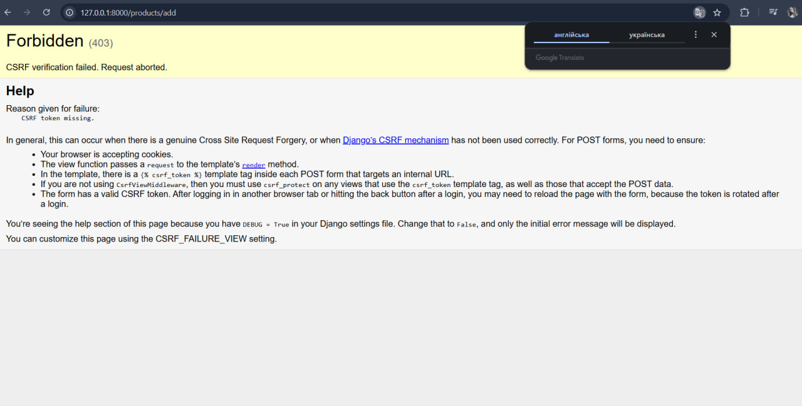

# SELF-STUDY — ПР №2.5
## Що зроблено

- HTML-розмітка перенесена з views.py у шаблони Django.
- views.py більше не містить HTML - усі сторінки через render.
- Створено templates/base.html з блоками title і content.
- Меню і повідомлення винесені в templates/partials/.
- Створено власний фільтр uah і тег product_count.
- Підключено CSS через .
- Форма додавання товару містить , працює за схемою Post/Redirect/Get.

## Експеримент 1: автоекранування

Спробувала додати товар з назвою . У перегляді коду
сторінки бачу &lt;script&gt;alert(1)&lt;/script&gt;. Django автоматично екранує
HTML-символи, тому скрипт не виконується. Це захист від XSS-атак.

## Експеримент 2: DEBUG = False

При DEBUG = False стилі зникають (404 на /static/...). Django не роздає
статику при вимкненому DEBUG — це робота collectstatic.

## Експеримент 3: CSRF 403

Тимчасово прибрала  з форми. При відправці POST Django
повернув помилку 403 CSRF verification failed з причиною "CSRF token missing".
Тому можна побачити, що Django захищає форми від підроблених міжсайтових запитів.
Токен у формі має збігатися з cookie csrftoken, бо інакше запит відхиляється.

## Джерела

- Django Girls — Шаблонне розширення
- Django documentation — CSRF
- Django documentation — Custom template tags

